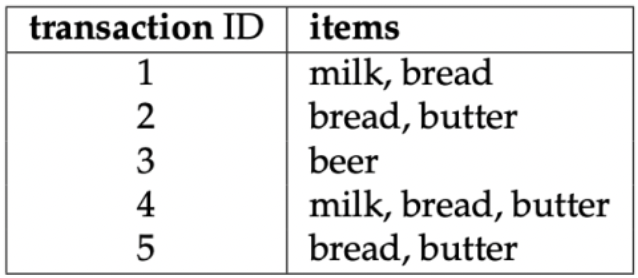

```{r setup, include=FALSE}
knitr::opts_chunk$set(collapse = TRUE)
```

## Clasificación asociativa

En la literatura se han propuesto varios métodos para crear clasificadores basados en reglas descubiertas a través de la minería de reglas de asociación (association rule minning). Estos clasificadores se denominan clasificadores asociativos, y el algoritmo más conocido en lasificación basada en asociaciones es CBA (Classification based on associations). Curiosamente, solo hay unas pocas implementaciones disponibles, y hasta hace poco no había ninguna implementación disponible. 

Este documento presenta la clasificación asociativa y cómo se puede usar.

## Introducción

El aprendizaje de reglas de asociación (Agrawal et al., 1993) se diseñó inicialmente para la exploración de datos para descubrir patrones interesantes en conjuntos de datos muy grandes y dispersos. Varios años después de su creación, el aprendizaje de reglas de asociación también se adaptó para crear modelos de clasificación basados en reglas. El primer algoritmo llamado CBA (clasificación basado en asociaciones) fué introducido por Liu et al. (1998).

Nuestro análisis de los algoritmos de reglas de asoaciación esta divido en varias partes. Primero presentamos la la minería de reglas de asociación, seguida de una discusión del algoritmo CBA. Presentamos las implementaciones de CBA existentes y nos centramos en las características y el uso de las tres nuevas implementaciones.

## Antecedentes: minería de reglas de asociación

Los clasificadores asociativos cómo CBA se basan en reglas de asociación. Las reglas de asociación minera fueron introducidas por primera vez por Agrawal et al. (1993) y, siguiendo la notación utilizada por Agrawal et al. (1993), Hahsler et al. (2005) y Tan et al. (2006), puede definirse formalmente como:

Sea $D=\{t_{1},t_{2}...,t_{m}\}$ un conjunto de transacciones llamada _database_, y sea $I=\{I_{1},I_{2}...,I_{n}\}$ el conjunto de todos los elementos considerados en la base de datos. Cada transacción en D tiene una ID de transacción única y contiene un subconjunto de los artículos en I. Para ilustrar los conceptos, usamos un pequeño ejemplo del dominio del supermercado presentado por Hahsler et al. (2005). El conjunto de los artículos es $D=\{leche, pan, mantequilla, cerveza\}$, en la figura de abajo se muestra una pequeña base de datos que contiene cinco transacciones con estos artículos. 

Una regla de ejemplo para el supermercado podría ser $\{leche, pan\} \Rightarrow \{mantequilla\}$ que significa que si compra leche y pan, los clientes también pueden comprar mantequilla.

{width=50%}
Una regla se define cómo una expresión $X\Rightarrow Y$. $X$ e $Y$ se denominan antecedente (lado izquierdo o LHS) y consecuente (lado derecho o RHS) d ela regla. A menudo, las reglas se limitan a un solo elemento en el consecuente. Las reglas de asociación son reglas que cumplen con los umbrales mínimos de soporte y confianza mínimos especificados por el usuario. 

El soporte $supp(X)$ d eun conjunto de elementos $X$ es una medida de importancia definida cómo la proporción de transacciones en el conjunto de datos que contienen el conjunto de elementos. La confianza de una regla se define como $conf(X\Rightarrow Y)=supp(XUY)/supp(X)$, midiendo la probabilidad de ver $Y$ en una transacción que contiene $X$.

Por ejemplo, la regla $\{lecha, pan\} \Rightarrow \{mantequilla\}$ tiene un respaldo de $1/5=0.2$ y una confianza de $0.2/0.4=0.5$ en la base de datos de la figura anterior, lo que significa que para el 50% de las trasacciones que contienen leche y pan, la regla es correcta. La confianza se puede interpretar cómo una estimación de la probabilidad $P(Y|X)$, la probabilidad de encontrar la RHS de la regla en transacciones bajo la condición de que éstas trasnacciones también contengan la RHS de la regla de transacciones bajo la condición de que estas trasacciones también contengan la LHS. 


